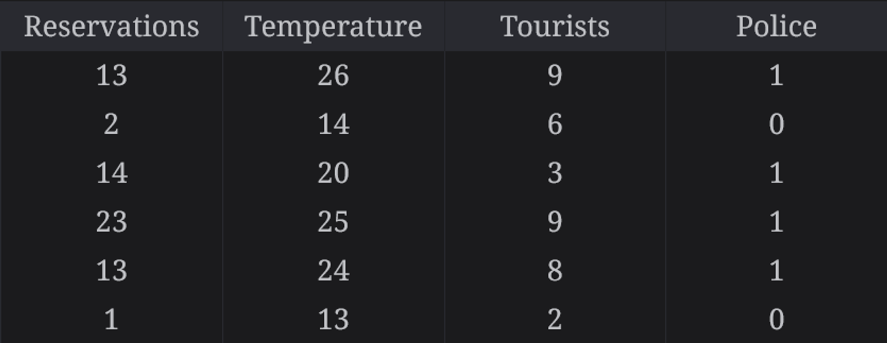
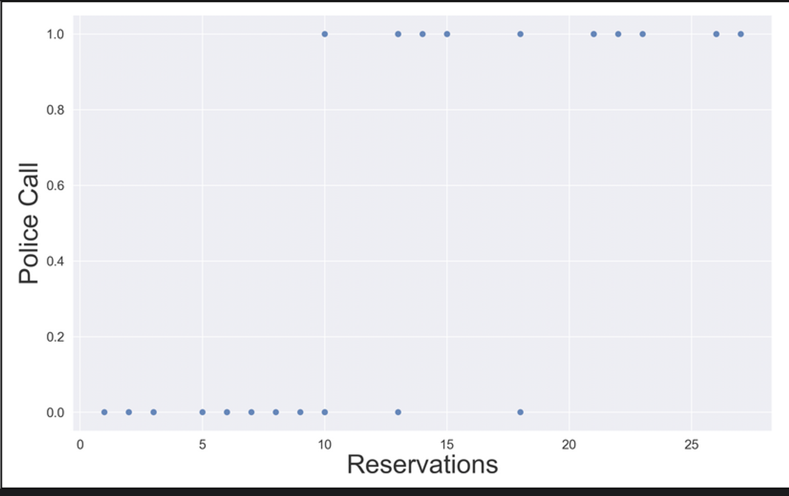
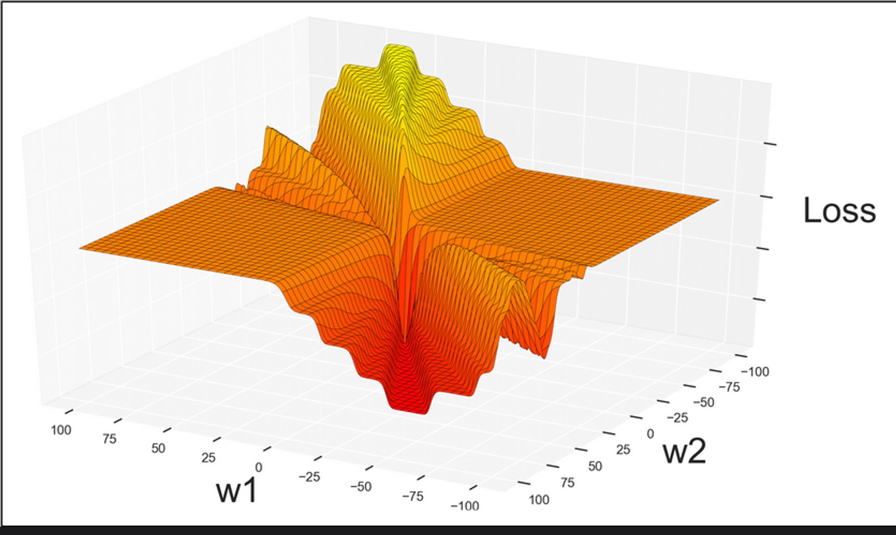
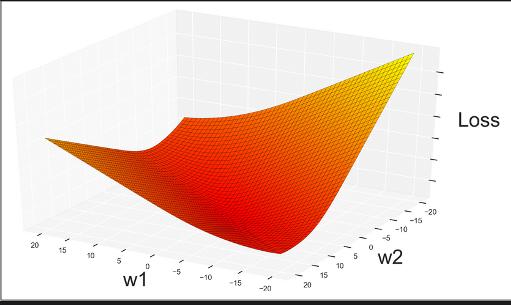

# Logistic Regression without any libraries
The problem is a binary classification task where the objective is to predict whether a police call is likely or not for the Pizza Shop. Not using any machine learning libraries. Will be using Numpy and Pandas for data manipulation and matplotlib for visualization.

The dataset represents information collected from a Pizza Shop in neighborhood. Each row in the dataset corresponds to a specific instance or observation, and the columns represent different features or variables. Here's an explanation of each column:

- Reservations: The number of reservations made at the pizzeria.
- Temperature: The temperature, possibly in degrees Celsius or Fahrenheit, on a given day.
- Tourists: The level of tourist activity, which could be a count or a measure of how busy the area is with tourists.
- Police: The target variable indicating whether a police call was made (1) or not (0) on a particular day.

Each row provides a set of values for these features, and the goal is to use this data to predict whether the presence of certain factors (Reservations, Temperature, Tourists) is likely to lead to a police call at the pizzeria (Police = 1).

## Loading the Data


```python
# Load libraries
import numpy as np
import pandas as pd
import matplotlib.pyplot as plt
```


```python
dataframe = pd.read_csv("police.csv")
dataframe.head(5)
```


<div>
<table border="1" class="dataframe">
  <thead>
    <tr style="text-align: right;">
      <th></th>
      <th>Reservations</th>
      <th>Temperature</th>
      <th>Tourists</th>
      <th>Police</th>
    </tr>
  </thead>
  <tbody>
    <tr>
      <th>0</th>
      <td>13</td>
      <td>26</td>
      <td>9</td>
      <td>1</td>
    </tr>
    <tr>
      <th>1</th>
      <td>2</td>
      <td>14</td>
      <td>6</td>
      <td>0</td>
    </tr>
    <tr>
      <th>2</th>
      <td>14</td>
      <td>20</td>
      <td>3</td>
      <td>1</td>
    </tr>
    <tr>
      <th>3</th>
      <td>23</td>
      <td>25</td>
      <td>9</td>
      <td>1</td>
    </tr>
    <tr>
      <th>4</th>
      <td>13</td>
      <td>24</td>
      <td>8</td>
      <td>1</td>
    </tr>
  </tbody>
</table>
</div>


## Where Linear Regression Fails
Linear Regression is all about approximating data with a line. It works well when the data is linearly separable. But when the data is not linearly separable, it fails to give good results. In such cases, we use Logistic Regression. Logistic Regression is a classification algorithm. It is used to predict a binary outcome (1 / 0, Yes / No, True / False) given a set of independent variables.

## Intro to Logistic Regression
Logistic Regression is a statistical method for analyzing a dataset in which there are one or more independent variables that determine an outcome. The outcome is measured with a dichotomous variable (in which there are only two possible outcomes). In logistic regression, the dependent variable is binary or dichotomous, i.e. it only contains data coded as 1 (TRUE, success, pregnant, etc.) or 0 (FALSE, failure, non-pregnant, etc.).

The logistic regression model is a linear model for binary classification. It models the probability that an observation belongs to a category. If the probability is greater than 0.5, the model predicts that the observation belongs to that category. If the probability is less than 0.5, the model predicts that the observation does not belong to that category.



This is a classification problem because we want to classify data as either 0 or 1.
To make our life easier let’s ignore the Temperature and Tourists columns for now, and plot the Reservations column against the label.



Not only is linear regression a bad approximation for categorical data, it is also an unstable approximation.

Even though linear regression is not a natural fit for binary classification, that  does not mean that we have to scrap our linear regression code and start from scratch. Instead, we can adapt our existing algorithm to this new problem using a technique called **Logistic Regression.**

## Overview of Sigmoids

In Linear Regression, $\hat{y}$ could take any value. Binary Classification, however, imposes a tighter restriction on the output. The output must be between 0 and 1. To achieve this, we use the sigmoid function.

### The wrapper function

The wrapper function takes any number out of the weighted sum, and squashes it between 0 and 1. 
The other requirement is that the function should work with gradient descent.
For the sake of gradient descent, the wrapper function should be smooth, without flat areas or gaps.

The sigmoid function is a good choice for this. It is defined as:

$$\sigma(z) = \frac{1}{1 + e^{-z}}$$

Where z is the weighted sum of the inputs.


```python
def sigmoid (z):
    return 1 / (1 + np.exp(-z))
```

Modifying the predict function to pass the result ot sigmoid function.
Process of moving data through the sigmoid function is called **forward propagation**, so renaming the predict function to forward.


```python
def forward(X, w):
  weighted_sum = np.matmul(X, w) 
  return sigmoid(weighted_sum)
```

The labels that we use to train the classifier are either 0 or 1, so the classification should also be a straight 0 or 1. To get that unambiguous answer, during the classification phase, we can round the result to the nearest integer.


```python
def classify(X, w):
  return np.round(forward(X, w))
```

## Smoothing it Out

We introduced a subtle problem by adding the sigmoid to out program. We made gradient descent less reliable. The problem happens when we update the loss() function in our system to use the new classification code.
We introduced a subtle problem by adding the sigmoid to out program. We made gradient descent less reliable. The problem happens when we update the loss() function in our system to use the new classification code.



If we use the mean squared error and sigmoid together, the resulting loss has an uneven surface littered with local minima. This makes gradient descent less reliable.

The solution is to use a different loss function. The loss function should be smooth and have a slope that is easy to work with. The loss function that fits these criteria is called the **Log Loss**.
It is based on logarithms and is defined as:

$$L(y, \hat{y}) = -\frac{1}{m} \sum_{i=1}^{m} (y_{i}.log(\hat{y}_{i}) + (1-y_{i}) . log(1-\hat{y}_{i}) ) $$

Where y is the label and $\hat{y}$ is the prediction.




```python
def loss(X, Y, w):
    y_hat = forward(X, w)
    first_term = Y * np.log(y_hat)
    second_term = (1 - Y) * np.log(1 - y_hat) 
    return -np.average(first_term + second_term)
```

## Updating the Loss Function

The loss function is the most important part of the classifier. It tells us how well the classifier is doing. The loss function is a measure of how well the classifier is doing. The goal of the classifier is to minimize the loss function.

THe partial derivative of the log loss with respect to the weights is:

$$\frac{\partial L}{\partial w} = \frac{1}{m} \sum_{i=1}^{m} ( \hat{y}_{i} - y_{i} ) . x_{i}$$


```python
def gradient(X, Y, w):
    return np.matmul(X.T, (forward(X, w) - Y)) / X.shape[0]
```

## Preparing the Data


```python
# Separate features (X) and target variable (y) for training set
X = dataframe.drop("Police", axis=1)
X = X.to_numpy()
x1, x2, x3 = X.T
X = np.column_stack((np.ones(x1.size), x1, x2, x3))

y = dataframe["Police"]
y = y.to_numpy().reshape(-1, 1)
```

## Training and Testing


```python
def train(X, Y, iterations, lr):
    w = np.zeros((X.shape[1], 1))
    for i in range(iterations):
        if (i%2000==0 or i==9999):
            print("Iteration %4d => Loss: %.20f" % (i, loss(X, Y, w)))
        w -= gradient(X, Y, w) * lr
    return w

# Doing inference to test our model
def test(X, Y, w):
    total_examples = X.shape[0]
    correct_results = np.sum(classify(X, w) == Y)
    success_percent = correct_results * 100 / total_examples
    print("\nSuccess: %d/%d (%.2f%%)" %
          (correct_results, total_examples, success_percent))
```


```python
w = train(X, y, iterations=10000, lr=0.001)

# Test it
test(X, y, w)
```

    Iteration    0 => Loss: 0.69314718055994517520
    Iteration 2000 => Loss: 0.37706099247397129037
    Iteration 4000 => Loss: 0.36771744812662249258
    Iteration 6000 => Loss: 0.36435486891522744779
    Iteration 8000 => Loss: 0.36203803321379474101
    Iteration 9999 => Loss: 0.35997223795473720642
    
    Success: 30/34 (88.24%)
    
