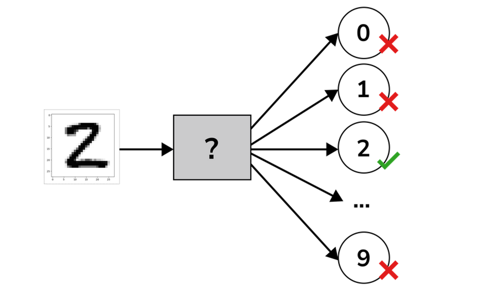
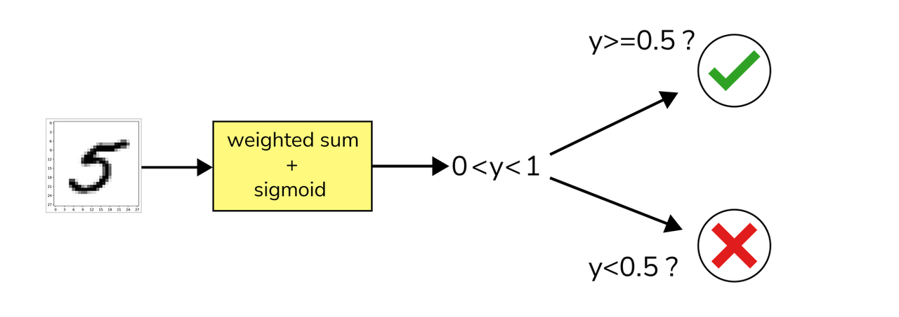
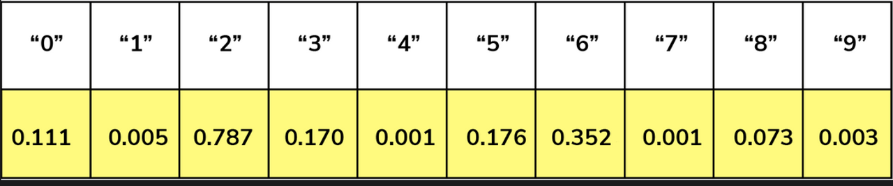
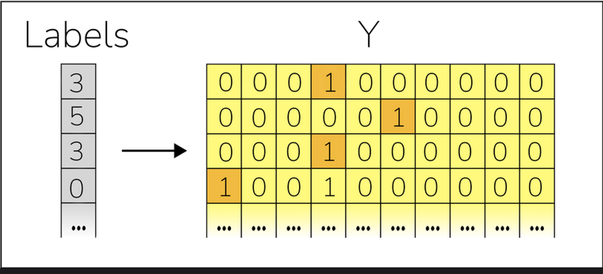

# MNIST Multi Class Classification
In [**MNIST Binary Classification**](https://github.com/UsamaKashif/MachineLearning-the-right-way/tree/main/03-%20MNIST%20Binary%20Classification) we have seen how to classify binary classes using MNIST dataset. In this notebook, we will see how to classify multiple classes using MNIST dataset. We will use the same dataset but this time we will classify all the 10 classes.



Here is the simple recipie for multiclass classification:
- Build a binary classifier for each class
- Combine the classifiers from each class into one multi-class classifier

## Build a MultiClass Classifier



Weighted Sum plus Sigmoid [WSS] is like a binary classifier, except that instead of returning either 0 or 1, it returns a floating-point number between 0 and 1. We build an array of ten WSSs, one per class from the 0 - 9. If we run them all we get an array of ten numbers



## One Hot Encoding



This way of encoding labels is called one-hot encoding, because only one value per row is 11. The rest are zeros.

We don’t run our code ten times, once per class. Instead, we run it once, with one column per class. It’s as if each column in the matrix contained the binary encoding for one of the WSSs. This matrix multiplication-based approach works just as well as running a classifier ten times, but it’s much faster.

## Decoding the Output

During the classification phase, the WSSs return arrays of ten numbers from 0 to 1. But we do not want to see those arrays, we want a human-readable answer such as “3”. This means we need to decode the WSSs answers before returning them.


```python
# Libraries
import numpy as np
import gzip
import struct
```

### Load Images


```python
def load_images(filename):
    # Open and unzip the file of images:
    with gzip.open(filename, 'rb') as f:
        # Read the header information into a bunch of variables:
        _ignored, n_images, columns, rows = struct.unpack('>IIII', f.read(16))
        # Read all the pixels into a NumPy array of bytes:
        all_pixels = np.frombuffer(f.read(), dtype=np.uint8)
        # Reshape the pixels into a matrix where each line is an image:
        return all_pixels.reshape(n_images, columns * rows)


def prepend_bias(X):
    # Insert a column of 1s in the position 0 of X.
    # (“axis=1” stands for: “insert a column, not a row”)
    return np.insert(X, 0, 1, axis=1)
```

### Load Labels


```python
def load_labels(filename):
    # Open and unzip the file of images:
    with gzip.open(filename, 'rb') as f:
        # Skip the header bytes:
        f.read(8)
        # Read all the labels into a list:
        all_labels = f.read()
        # Reshape the list of labels into a one-column matrix:
        return np.frombuffer(all_labels, dtype=np.uint8).reshape(-1, 1)


def one_hot_encode(Y):
    n_labels = Y.shape[0]
    n_classes = 10
    encoded_Y = np.zeros((n_labels, n_classes))
    for i in range(n_labels):
        label = Y[i]
        encoded_Y[i][label] = 1
    return encoded_Y
```


```python
# 60000 images, each 785 elements (1 bias + 28 * 28 pixels)
X_train = prepend_bias(load_images("data/train-images-idx3-ubyte.gz"))

# 10000 images, each 785 elements, with the same structure as X_train
X_test = prepend_bias(load_images("data/t10k-images-idx3-ubyte.gz"))

# 60K labels, each a single digit from 0 to 9
Y_train_unencoded = load_labels("data/train-labels-idx1-ubyte.gz")

# 60K labels, each consisting of 10 one-hot encoded elements
Y_train = one_hot_encode(Y_train_unencoded)

# 10000 labels, each a single digit from 0 to 9
Y_test = load_labels("data/t10k-labels-idx1-ubyte.gz")
```


```python
# Applying Logistic Regression
def sigmoid(z):
    return 1 / (1 + np.exp(-z))

# Basically doing prediction but named forward as its 
# performing Forward-Propagation
def forward(X, w):
    weighted_sum = np.matmul(X, w)
    return sigmoid(weighted_sum)

# Calling the predict() function
def classify(X, w):
    y_hat = forward(X, w)
    labels = np.argmax(y_hat, axis=1)
    return labels.reshape(-1, 1)

# Computing Loss over using logistic regression
def loss(X, Y, w):
    y_hat = forward(X, w)
    first_term = Y * np.log(y_hat)
    second_term = (1 - Y) * np.log(1 - y_hat)
    return -np.sum(first_term + second_term) / X.shape[0]

# calculating gradient
def gradient(X, Y, w):
    return np.matmul(X.T, (forward(X, w) - Y)) / X.shape[0]

# Printing results to the terminal screen
def report(iteration, X_train, Y_train, X_test, Y_test, w):
    matches = np.count_nonzero(classify(X_test, w) == Y_test)
    n_test_examples = Y_test.shape[0]
    matches = matches * 100.0 / n_test_examples
    training_loss = loss(X_train, Y_train, w)
    if (iteration%20 == 0) or iteration == 199:
        print("%d - Loss: %.20f, %.2f%%" % (iteration, training_loss, matches))

# calling the training function for desired no. of iterations
def train(X_train, Y_train, X_test, Y_test, iterations, lr):
    w = np.zeros((X_train.shape[1], Y_train.shape[1]))
    for i in range(iterations):
        report(i, X_train, Y_train, X_test, Y_test, w)
        w -= gradient(X_train, Y_train, w) * lr
    report(iterations, X_train, Y_train, X_test, Y_test, w)
    return w
```


```python
w = train(X_train, Y_train,
          X_test, Y_test,
          iterations=200, lr=1e-5)
```

    0 - Loss: 6.93147180559945397249, 9.80%
    20 - Loss: 1.25378277537179583234, 86.22%
    40 - Loss: 1.08333180073001211774, 87.81%
    60 - Loss: 1.00734656458890392550, 88.66%
    80 - Loss: 0.96254470749127318818, 89.22%
    100 - Loss: 0.93231667470232026940, 89.39%
    120 - Loss: 0.91020541845761471222, 89.65%
    140 - Loss: 0.89313863437623119967, 89.80%
    160 - Loss: 0.87945224017547751760, 90.02%
    180 - Loss: 0.86815894847049102090, 90.18%
    199 - Loss: 0.85907344837140864335, 90.32%
    200 - Loss: 0.85863196488041293453, 90.32%
    


```python

```
