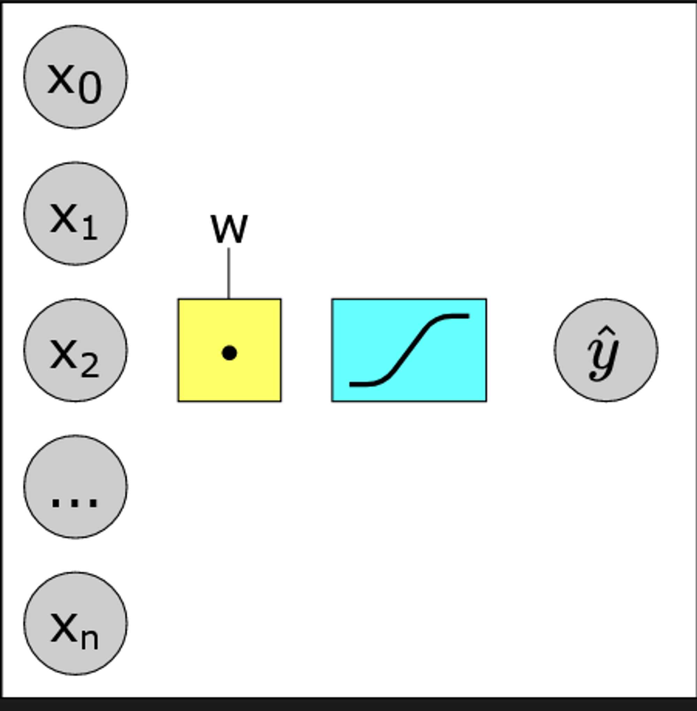
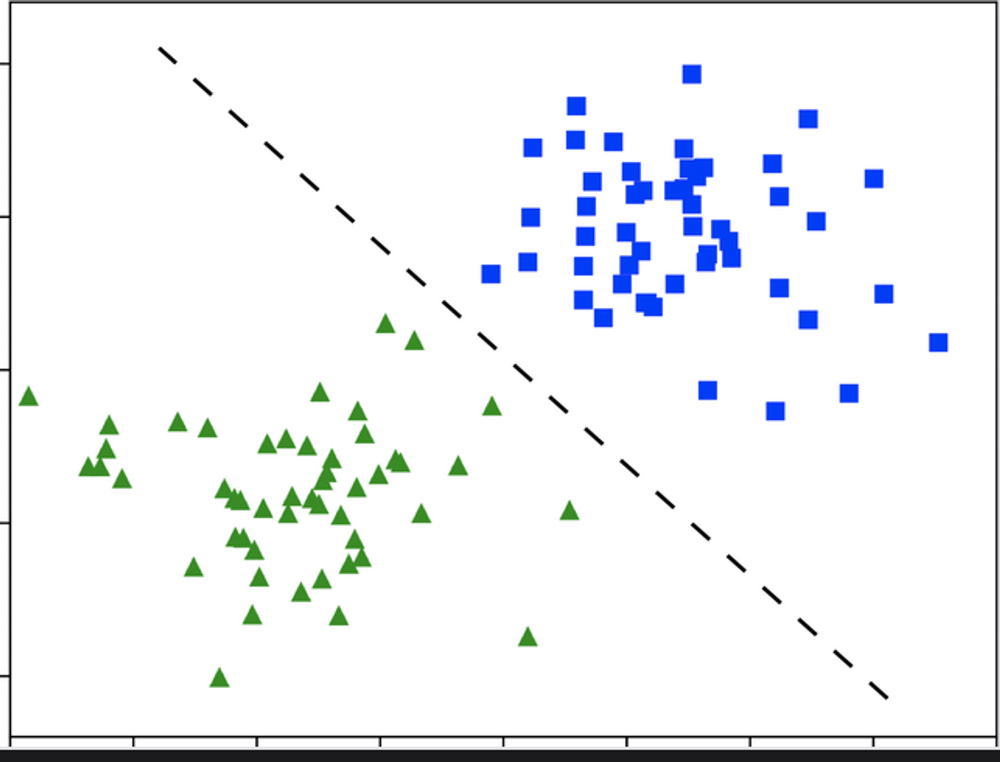
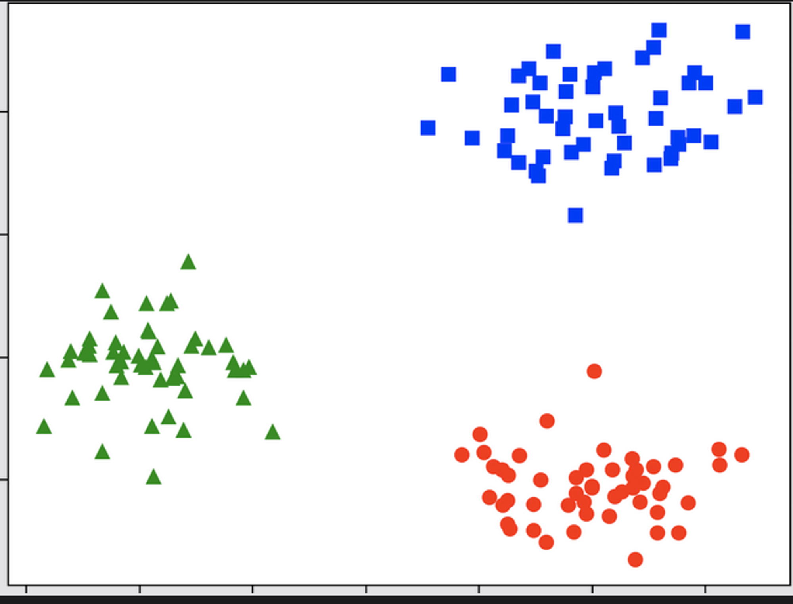
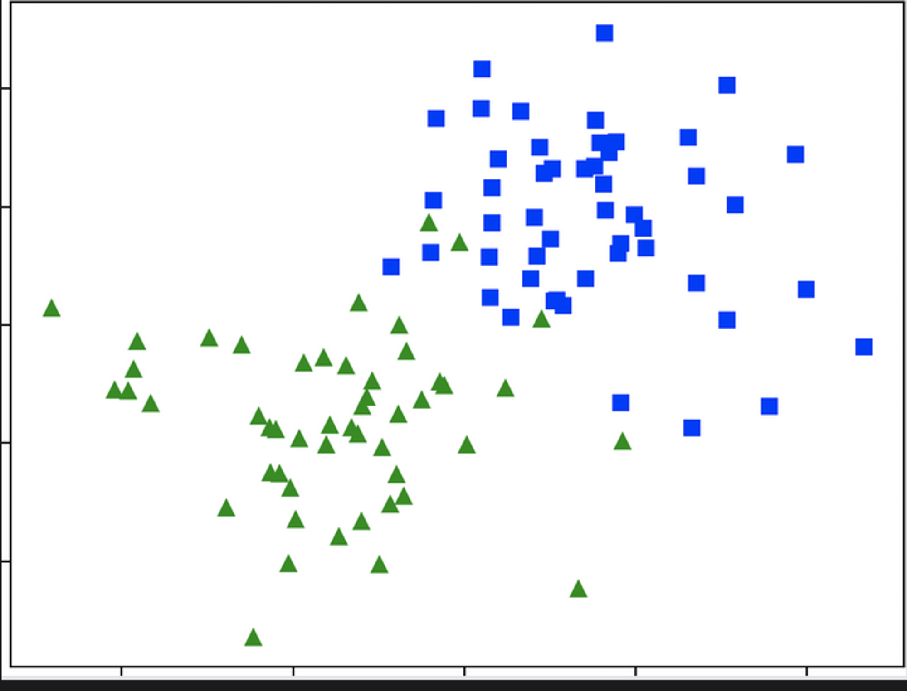

## What is a Perceptron
A Perceptron is an algorithm for supervised learning of binary classifiers. This algorithm enables neurons to learn and process elements in the training set one at a time.
The perceptron is a great building block for more complex systems.  
The Perceptron is a single layer neural network. It is a process of learning the weights of the input features to make binary predictions.
The Perceptron algorithm is also termed as a linear classifier.
In our previous examples, our system reads all the examples together, rather than one at a time.
In a way, that operation is like stacking multiple perceptrons together.

## How does a Perceptron work?

Here's a basic overview of how a perceptron works:
1. Input Layer: The perceptron takes input from multiple sources. Each input is assigned a weight, which represents its importance. These inputs could be anything from pixel values in an image to features in a dataset.
2. Weighted Sum: The inputs are multiplied by their weights and summed together. This is the weighted sum.
3. Activation Function: The weighted sum is then passed through an activation function. This function determines whether the perceptron "fires" or not. The most common activation function is the step function, which outputs 1 if the weighted sum is greater than a threshold, and 0 otherwise.
4. Learning: The perceptron is trained using a learning algorithm. This algorithm adjusts the weights of the inputs based on the error in the output. The goal is to minimize this error over time.
5. Iteration: The process is repeated for each input in the training set. The weights are updated after each iteration to improve the accuracy of the perceptron.

## Where Perceptron Fail
The perceptron has some limitations. It can only learn linearly separable patterns, which means it cannot learn patterns that are not linearly separable. This is a significant limitation, as many real-world problems are not linearly separable. For example, the XOR function cannot be learned by a single perceptron.

### Linearly Separable Data

The two classes in the data are green triangles and blue squares. They are neatly arranged into distinct clusters. We can even separate them with a line.
Datasets that can be partitioned with a straight line, like the one we get here, are called linearly separable datasets. 

### Multi-Class Linearly Separable Data

With three classes, we can still separate them with straight lines. This is a multi-class linearly separable dataset.
We will achieve this by combining multiple binary classifiers. Each binary classifier will separate one class from the rest.

### Non-Linearly Separable Data

This dataset is not linearly separable. Whichever line we draw, some data points fall into the opposite class’s camp. In this specific case, a perceptron could still separate most squares from most triangles, and come up with a decent classification. As the data gets more tangled, however, things get complicated.

## Conclusion
The perceptron is a simple and powerful algorithm for learning binary classifiers. It is a building block for more complex neural networks and machine learning models. However, it has some limitations, such as only being able to learn linearly separable patterns. Despite these limitations, the perceptron is still widely used in many applications and research areas.